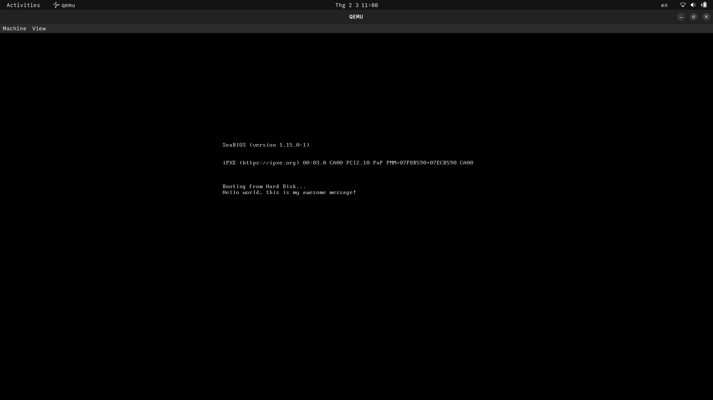

# Real Mode

Real mode is an operating mode of x86-compatible CPUs. It is characterized by:

- Direct access to all memory, I/O addresses, and hardware.
- A 16-bit segmented memory address space, allowing access to 1 MB of memory.
- No memory protection or multitasking capabilities.

Real mode is primarily used for bootstrapping and running legacy software.

## 1 MB of RAM accessible

- Memory access is done through the segmentation memory model
- Only 1 MB of RAM is accessible and addressable, it does not matter if you have 4 GB RAM

## No Security

- Provides no memory security
- Provides no hardware security
- Therefore, simple user program can destroy the operating system with no way for us to stop them

## Writing a bootloader 

A bootloader is a set of CPU instructions (usually written in assembly) that is loaded by the BIOS when a PC is booted. Bootloader's code sits at 0x7c00 when loaded into the memory, and must be 1 sector (= 512 bytes) long. The end of the bootloader code is marked by a 2-byte signature 0x55AA.

## [Segmentation Memory Model](https://wiki.osdev.org/Segmentation)

- Memory is accessed by a segment and an offset
- Programs can be loaded in different areas of memory but run without any problems
- Multiple segments are available through the use of segment registers

In Real Mode you use a logical address in the form A:B to address memory. This is translated into a physical address using the equation:

```
Physical address = (A * 0x10) + B
```

## Segment Registers

In Real Mode, the x86 architecture uses several segment registers to access different parts of memory. Each segment register points to a specific segment in memory:

- **CS (Code Segment):** Points to the segment containing the current program code. The instruction pointer (IP) uses this segment to fetch instructions.
- **DS (Data Segment):** Points to the segment where data is stored. This is the default segment for most data operations.
- **SS (Stack Segment):** Points to the segment containing the stack. The stack pointer (SP) and base pointer (BP) use this segment for stack operations.
- **ES (Extra Segment):** An additional data segment used for string and memory operations.
- **FS and GS:** Additional segment registers available in later x86 processors for general-purpose use.

These segment registers allow the CPU to access different areas of memory efficiently and are essential for the segmented memory model used in Real Mode.

## [Interrupt Vector Table](http://wiki.osdev.org/Exceptions)

- In Real Mode, the Interrupt Vector Table (IVT) is loaded at 0x00. IVT is a table that specifies the addresses of interrupt handlers. Each slot takes 4 bytes - the first 2 bytes are the offset, and the second 2 bytes are the segment.
- IVT has 256 interrupt handlers.

```
 +-----------+-----------+
 |  Offset   | Segment   |
 +-----------+-----------+
 0           2           4
 ```

Here are examples of how interrupt vectors are mapped to their respective addresses in the Interrupt Vector Table (IVT):

- **int 0x00** ~ address 0x00
- **int 0x01** ~ address 0x04
- **int 0x02** ~ address 0x08

The values of 0x08-0x11 are 00 01 11 11, which means the address of ISR (int 0x02) is calculated as follows:

```
Physical address = (0x1111 * 16) + 0x0001 = 0x11110 + 0x0001 = 0x11111
```

To define a custom interrupt handler, we first define a routine with a label and then write the segment/offset of the routine to IVT.

## Reading From The Disk

The bootloader is appended the content of [boot5.txt](../examples/bootloader/boot5.txt) at the end of binary file (see [Makefile](../examples/bootloader/Makefile)).

When we start up a QEMU with `boot5.bin`, it treats it as a hard disk.

Whenever the CPU reads data from a hard disk, it must be one full sector (512 bytes). We need to make sure that our message (starting from the second sector 0x200 because we use the first sector for our bootloader code), is padded with zeros until the end of the sector.

Disk access is done via [`Int13h/AH=02h`](http://www.ctyme.com/intr/rb-0607.htm).

Note how we created an empty label called `buffer` at the very end of the bootloader code. Because the bootloader code is 512 bytes, this label is not loaded into the memory. That doesn't mean we cannot use the memory pointed by this label. Since the label is at the end, it points to 0x7e00 = 0x7c00 (start of the bootloader) + 0x200 (512 bytes).

