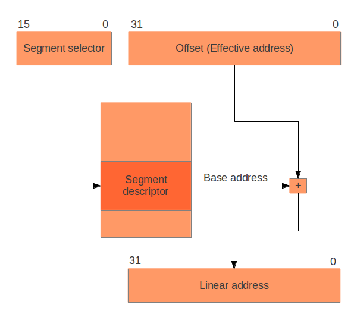
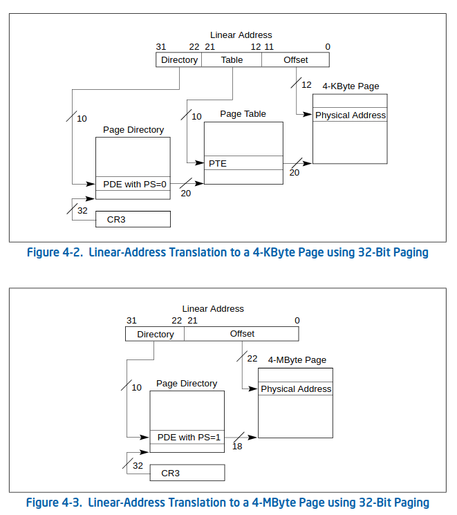

# Address Translation

Consider the following C program:

```C
#include <stdio.h>
#include <stdlib.h>

int main() {
    int a = 10; // Local variable
    int *ptr = (int *)malloc(sizeof(int)); // Dynamically allocated memory
    *ptr = 20;

    printf("Address of local variable 'a': %p\n", (void *)&a);
    printf("Address stored in pointer 'ptr': %p\n", (void *)ptr);

    free(ptr);
    return 0;
}
```

Output:

```
Address of local variable 'a': 0x7ffee4b5b6ac
Address stored in pointer 'ptr': 0x600000000010
```

These addresses are logical (virtual) addresses assigned by the operating system.

## How To Convert Logical Address to Physical Address

The translation involves 2 steps.

### Segmentation

The logical address is divided into a segment selector and an offset.

Segment selector is used to identify a segment descriptor in the GDT, the segment descriptor provides the base address and the size of address space.

The `linear address` is calculated by adding the base address and the offset. When paging is disabled, then the linear address space is mapped 1:1 onto the physical address space, and the physical memory can be accessed.



### Paging in x86

Paging translates these linear addresses onto the physical address space, and determines access rights and how the memory should be cached. The hardware component is responsible to do paging is MMU.

Paging is optional. Some OSes do not make use of it. But if we want to mark certain areas of memory accessible to run at a certain privilege level (to be able to have processes running at different privilege levels), paging is the neatest way to do that.

Paging in x86 consists of:
- Page Directory Table (PDT)
- Page Table (PT)
- Page Frame (PF)

PDT has 1024 entries that references to 1024 page tables (PT). Each PT (PTE) points to 1024 sections of physical memory or 1024 page frame (PF). Each page frame is 4096 byte large. (NOTE: PS=0)

=> A Page Directory Table can manage up to 4 GB address.

In a linear address, the highest 10 bits specifies the offset of a page directory entry (PDE) in the current PDT, the next 10 bits the offset of a page table entry (PTE) within the page table pointed to by that PDE. The lowest 12 bits in the address is the offset within the page frame to be addressed.

When PS=1, the page frame is 4 MB large. A PDE then points directly to a 4 MB page frame. The address translation is almost the same as in the figure, with just the page table step removed. 




