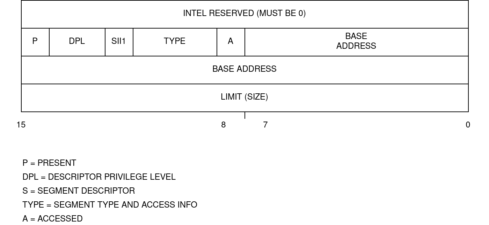

# Global Descriptor Table

A Global Descriptor Table (GDT) is an array of 8-byte segment descriptors.

## Terminologies

- Segment: A logically contiguous chunk of memory with consistent properties (from the CPU's perspective).
- Segment Register: A register of your CPU that refers to a segment for a particular purpose (CS, DS, SS, ES) or for general use (FS, GS)
- Segment Selector: A reference to a descriptor, which you can load into a segment register; the selector is an offset into a descriptor table pointing to one of its entries.
- Segment Descriptor: An entry in a descriptor table. These are a binary data structure that tells the CPU the attributes of a given segment.



## What Put In GDT

The first descriptor in the GDT is always a null descriptor and can never be used to access memory.

```
; GDT
gdt_start:
gdt_null:
    dd 0x0 ; Null descriptor
    dd 0x0
```

Table 3-1 in chapter 3 of the [Intel Manual](https://www.intel.com/content/dam/www/public/us/en/documents/manuals/64-ia-32-architectures-software-developer-vol-3a-part-1-manual.pdf) specifies the values for the Type field. The table shows that the Type field can’t be both writable and executable at the same time. Therefore, two segments are needed: one segment for executing code to put in cs (Type is Execute-only or Execute-Read) and one segment for reading and writing data (Type is Read/Write) to put in the other segment registers.

```
gdt_code_seg:
    dw 0xFFFF ; Limit
    dw 0x0 ; Base
    db 0x0 ; Base
    db 0x9A ; Access byte: Present, Ring 0, Code segment, Executable, Readable
    db 11001111b ; Flags (4-bit) + Limit (high 4-bit) (4KB granularity, 32-bit segment)
    db 0x0 ; Base

gdt_data_seg:
    dw 0xFFFF ; Limit
    dw 0x0 ; Base
    db 0x0 ; Base
    db 0x92 ; Access byte: Present, Ring 0, Data segment, Read/Write
    db 11001111b ; Flags (4-bit) + Limit (high 4-bit) (4KB granularity, 32-bit segment)
    db 0x0 ; Base
```

In summary, the segments needed are:

| Index | Offset | Name                  | Address Range            | Type | DPL  |
|-------|--------|-----------------------|--------------------------|------|------|
| 0     | 0x00   | null descriptor       | -                        | -    | -    |
| 1     | 0x08   | kernel code segment   | 0x00000000 - 0xFFFFFFFF  | RX   | PL0  |
| 2     | 0x10   | kernel data segment   | 0x00000000 - 0xFFFFFFFF  | RW   | PL0  |