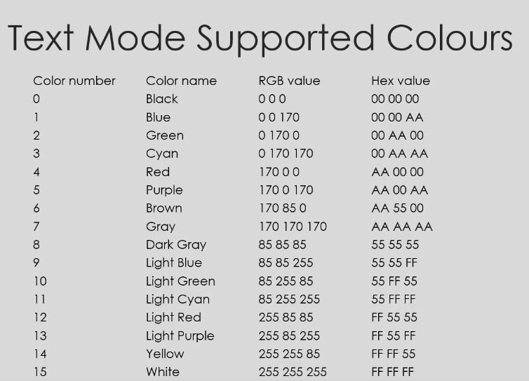

# Writing To Screen

## Text mode

Text mode allows you to write ASCII to video memory. It supports 16 unique colors and there's no need to set individual screen pixels for printing the characters.

### Text mode allows you to write ASCII to video memory

You write the ASCII characters into the memory starting at address 0xB8000 for colored characters.

Or address 0xB0000 for monochrome characters.

Supported colors in text mode:



### No need to set individual pixels for printing characters

Each character has 2 bytes.

- Byte 0 is ASCII character
- Byte 1 is color code

For example: We want to set row 0, column 0 to a black 'A'
```
0xB8000 = 'A'
0xB8001 = 0x00
```

Row 0, column 1 to a blue 'B'
```
0xB8002 = 'B'
0xB8003 = 0x01
```

### Printing by C code

In the `kernel_main` function, you can do like that for printing character:

```c
void kernel_main(void)
{
    char *video_memory = (char *)0xB8000;

    video_memory[0] = 'X';
    video_memory[1] = 0x04;
}
```

Or

```c
void kernel_main(void)
{
    uint16_t *video_memory = (uint16_t *)0xB8000;

    video_memory[0] = 0x0241;
}
```

### Screen coordinate

To access a particular character on the screen from X to Y coordinates is simple by using the following fomula:

```
position = (y_position * characters_per_line) + x_position; 
```